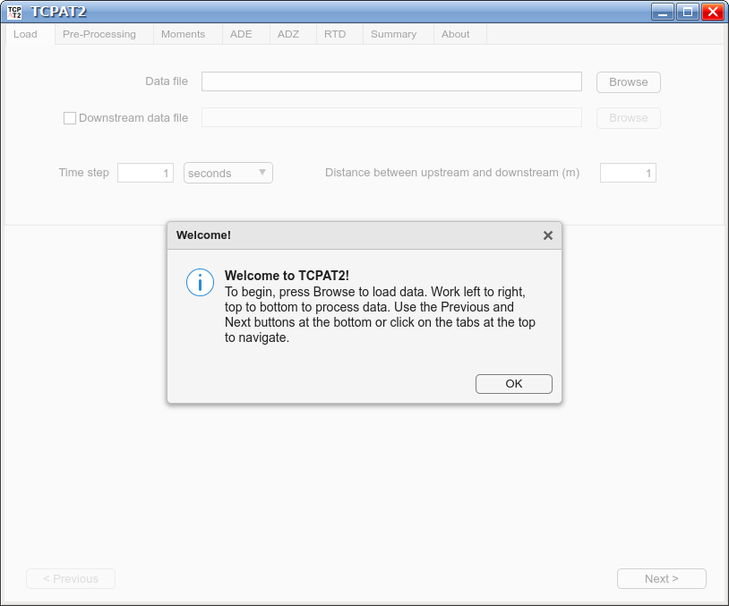
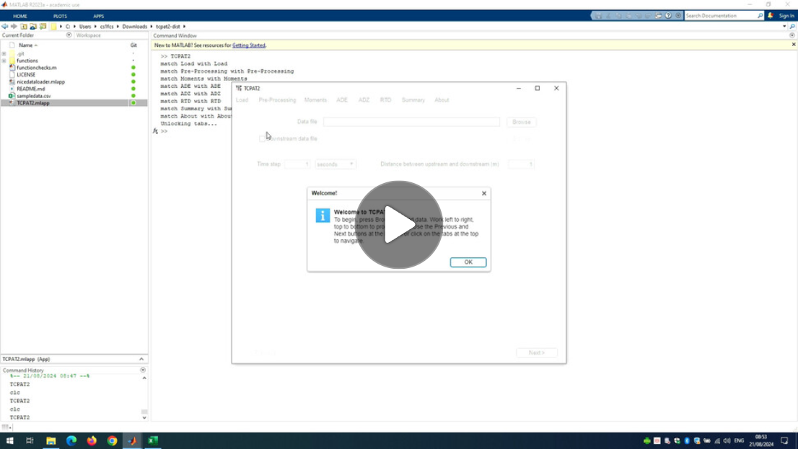

# Temporal Concentration Profile Analysis Tool 2 (TCPAT2)

[](https://matlab.mathworks.com/open/github/v1?repo=fredsonnenwald/TCPAT2&file=TCPAT2.mlapp)

TCPAT2 is a tool for analysing temporal concentration profiles, such as those used in river tracing, with a variety of one-dimensional modelling approaches including the Advection-Dispersion Equation (ADE), [Aggregated Dead Zone](https://doi.org/10.1061/(ASCE)0733-9372(1983)109:5(1049)) Modelling (ADZ/ADZM), and [Residence Time Distribution](https://en.wikipedia.org/wiki/Residence_time#Distributions) (RTD) modelling. In some cases the ADE may also be referred to as the Advection-Diffusion Equation or [Convection-Diffusion Equation](https://en.wikipedia.org/wiki/Convection%E2%80%93diffusion_equation).

Visit [http://sheffield.ac.uk/mixing-studies/](http://sheffield.ac.uk/mixing-studies/) to learn more about solute transport, concentration profiles, and mixing.

TCPAT2 was funded by EPSRC [EP/P012027/1](https://gow.epsrc.ukri.org/NGBOViewGrant.aspx?GrantRef=EP/P012027/1) and University of Sheffield [Unleash Your Data](https://www.sheffield.ac.uk/library/research-data-management/unleash-your-data-and-software-2024) funding.



If you have used TCPAT2 in your work and found it useful, please cite it as:

Sonnenwald, F. and Guymer, I. (2024). Temporal Concentration Profile Analysis Tool 2. The University of Sheffield. Software. https://doi.org/10.15131/shef.data.26739427

```
@misc{sonnenwald_TCPAT2,
    author      = {Fred Sonnenwald, Ian Guymer},
    title       = {Temporal Concentration Profile Analysis Tool 2},
    month       = {August},
    year        = {2024},
    doi         = {10.15131/shef.data.26739427},
    url         = {https://doi.org/10.15131/shef.data.26739427}
}
```

## Installation & Requirements

The TCPAT2 package consists of two main components, the TCPAT2 graphical application tool which runs in [MATLAB](https://uk.mathworks.com/products/matlab.html) and the underlying analysis functions, which can be run in Matlab or [GNU Octave](https://octave.org/).

The TCPAT2 graphical application tool can be installed/run in four different ways:

 * The tool's code can be downloaded and run from an existing MATLAB installation, in which case MATLAB R2021a or newer and the [Optimization Toolbox](https://uk.mathworks.com/products/optimization.html) is required.

 * The tool can be downloaded as a .exe installer that will download the free MATLAB Runtime as part of installation.

* The tool can be downloaded as a standalone .exe that requires a separate installation of the free [MATLAB Runtime R2023b](https://uk.mathworks.com/products/compiler/matlab-runtime.html).

 * The TPCAT2 graphical application tool can also be run without software installation in a web browser using a free MATALB Online account. [Open TCPAT2 in MATLAB Online](https://matlab.mathworks.com/open/github/v1?repo=fredsonnenwald/TCPAT2&file=TCPAT2.mlapp) without downloading or installing MATLAB.

To run the underlying TCPAT2 analysis functions directly requires either MATLAB with the Optimization Toolbox or GNU Octave with the statistics, struct, optim, control, and signal packages.

[Download TCPAT2 from ORDA](https://doi.org/10.15131/shef.data.26739427), the University of Sheffield's Online Research DAta repository.

## Usage

### Using the TCPAT2 graphical application tool

In general the TCPAT2 graphical application tool is meant to be used top to bottom right to left, going through and selecting the relevant options on the current screen, then pressing the Next button to move to the next screen. Analysis goes through data loading, pre-processing, method of moments analysis, Advection-Dispersion Equation analysis, Aggregated Dead Zone analysis, Residence Time Distribution analysis, before being summarised and exported.

Hovering your mouse over buttons and other controls will give more information about that control.

Please watch the following video for a demonstration of how to use the software.

[](https://digitalmedia.sheffield.ac.uk/media/TCPAT2+Introductory+Tutorial/1_4lg7uqhb)

#### Known issues

Image saving from the TCPAT2 graphical application tool saves an empty image when running MATLAB R2024a. This is a known bug in MATLAB. To work around this issue, please use an older (or newer) version of MATLAB.

### Using the TCPAT2 analysis functions

All analysis functions are located within the functions folder and can be activated by running the command `addpath functions/`. All functions have built-in help so that more about a function can be learned by running the command `help function_name` where function_name is the name of one of the functions discussed in this section.

All functions are tested/demonstrated in the `functionchecks.m` file.

The following functions are available:

`ade(time, data, tbar, D, dt, v)`

Make an concentration prediction using the routing solution to the Advection-Dispersion Equation (see Rutherford [1994] page 213-214).

`adz(data, alpha, delay, dt)`

Make an concentration prediction using the Aggregated Dead Zone model (see Rutherford [1994] page 223-229).

`conv(upstream, RTD)`

Convolves the upstream concentration data with a Residence Time Distribution (RTD) to make a downstream prediction. (This is a built-in function.)

`easydeconv(time, us, ds, [noPoints])`

Perform maximum entropy deconvolution on and upstream and downstream concentration profile to obtain the Residence Time Distribution (RTD) describing the transformation between the two.

`optimiseade(time, us, ds, mydist, x0)`

Find the least squares optimised dispersion coefficient and velocity between upstream and downstream concentration distributions.

`optimizedadz(time, us, ds, dt, x0)`

Find the least squares optimised aggregated dead zone alpha and time delay between upstream and downstream concentration distributions.

`rtSquared(original, new)`

Calculate Young's RT2 correlation (goodness-of-fit) coefficient (see Young et al [1980] equation 14).

### GNU Octave

All of the functions listed above are GNU Octave compatible, but may require additional [GNU Octave Packages](https://gnu-octave.github.io/packages/). To install the required packages please run

```matlab
pkg install statistics
pkg install struct
pkg install optim
pkg install control
pkg install signal
```

These can then be activated using

```matlab
pkg load statistics struct optim control signal
```

## Example concentration data

This archive includes sample data that to be analysed in the `sampledata.csv` file. This data is the raw data from the Hart et al. (2021) dataset for steady state pipe flow in a 24 mm diameter pipe, experimental configuration R17, instruments 1 (at *x* = 2.68 m) and 3 (at *x* = 7.08 m) with a bulk velocity of 0.488 m/s. The data is from turbulent pipe flow (Reynolds number around 10,000) so the mixing processes should be Gaussian.

For the sample data, the distance between instruments is 4.4 m.

Expected ADE analysis results:

* The method of moments prediction is reasonably good (RT2 >= 0.95).
* The optimised travel time should be around 9.4 seconds, optimised velocity around 0.47 m/s, and the optimised dispersion coefficient around 0.005 m2/s and fit should be very good (RT2 >= 0.99).
* First arrival time is earlier than expected.

Expected ADZ analysis results:

* The method of moments prediction is already very good (RT2 >= 0.99).
* The optimised travel time should be around 9.6 seconds and optimised time delay around 8.7 seconds and fit should be slightly better than the method of moments prediction (RT2 >= 0.99). The optimised values will be very similar to the method of moments values.
* First arrival time is later than expected.

Expected deconvolution results:

* The optimised residence time prediction should be perfect (RT2 >= 0.999) although it will not look perfectly Gaussian.
* Knowing the transformation should be Gaussian due to the data being turbulent pipe data, we can reduce the Number of Sample Points to 10 and find a more realistic RTD shape with as good a fit (RT2 >= 0.999).

### Example temporal concentration profile data sets

Other data that can be (or have been) analysed with this tool include:

* Guymer, Ian; Shuttleworth, Joe; Bailey, Olivia; Williams, Margaret; Frankland, James; Rhead, Becky; et al. (2022). Fluorescent dye traces in four UK sewer networks. The University of Sheffield. Dataset. https://doi.org/10.15131/shef.data.20480241
* Guymer, Ian; Stovin, Virginia; O'Brien, Rob; Dennis, Peter; Saiyudthong, Chanwit; Lau, Shing-Tak Douglas; et al. (2020). University of Sheffield Experimental Manhole Traces and CRTDs. The University of Sheffield. Dataset. https://doi.org/10.15131/shef.data.13373039
* Hart, James; Sonnenwald, Fred; Guymer, Ian (2021). Temporal Concentration Profiles in Steady and Unsteady Pipe Flow. The University of Sheffield. Dataset. https://doi.org/10.15131/shef.data.14135591

## Development notes

This code was written primarily using MATLAB. While the GUI portion is not GNU Octave compatible, the remaining functions are. All functions are tested/demonstrated in the `functionchecks.m` file and this can be run in GNU Octave to ensure compatibility.

The MATLAB applications live in compressed mlapp ZIP archive files. To track changes on the code these can be extracted automatically using a pre-commit [Git Hook](https://git-scm.com/book/en/v2/Customizing-Git-Git-Hooks). To add this hook, create a `.git/hooks/pre-commit` file containing:

```bash
#!/bin/sh
unzip -qq TCPAT2.mlapp matlab/document.xml -d mlapp
mv mlapp/matlab/document.xml mlapp/TCPAT2.xml
unzip -qq nicedataloader.mlapp matlab/document.xml -d mlapp
mv mlapp/matlab/document.xml mlapp/nicedataloader.xml
rmdir mlapp/matlab
git add mlapp/
```

Note this will require Linux, MacOS, or the Windows Subsystem for Linux and the git and unzip tools installed.

## References

The following references contain explanations of the underlying methods used in this software.

* Beer, T., & Young, P. C. (1983). Longitudinal dispersion in natural streams. Journal of environmental engineering, 109(5), 1049-1067. https://doi.org/10.1061/(ASCE)0733-9372(1983)109:5(1049)
* Fischer, H. B. (1979). *Mixing in inland and coastal waters*. Academic press.
* Rutherford, J. C. (1994). *River mixing*. Wiley.
* Sonnenwald, F., Stovin, V., & Guymer, I. (2014). Configuring maximum entropy deconvolution for the identification of residence time distributions in solute transport applications. *Journal of Hydrologic Engineering*, 19(7), 1413-1421. https://doi.org/10.1061/(ASCE)HE.1943-5584.0000929
* Sonnenwald, F., Stovin, V., & Guymer, I. (2015). Deconvolving smooth residence time distributions from raw solute transport data. *Journal of Hydrologic Engineering*, 20(11), 04015022. https://doi.org/10.1061/(ASCE)HE.1943-5584.0001190
* Taylor, G. I. (1954). The dispersion of matter in turbulent flow through a pipe. Proceedings of the Royal Society of London. Series A. Mathematical and Physical Sciences, 223(1155), 446-468. https://doi.org/10.1098/rspa.1954.0130
* Young, P., Jakeman, A., & McMurtrie, R. (1980). An instrumental variable method for model order identification. *Automatica*, 16(3), 281-294. https://doi.org/10.1016/0005-1098(80)90037-0
